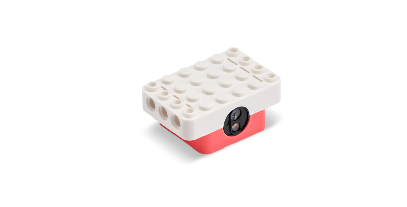

# LEGO® Education Python API


1. [Introduction and Installation](./README.md)
2. [Connect and Run](./connect.md)
3. [Single Motor](./singlemotor.md)
4. [Double Motor](./doublemotor.md)
5. **Color Sensor**
6. [Controller](./controller.md)
7. [Combine Single Motor and Color Sensor](./combine1.md)
8. [Combine Double Motor and Controller](./combine2.md)
9. [Constants](./constants.md)

---
# Color Sensor



The Color Sensor allows control and monitoring of a color sensor.

# Reading Data

Reading data from the Color Sensor can be done inline within your code or via a callback.

## Inline

```python
import legoeducation as le
import time

# update these values to match the Connection Card
card_color = le.LEGO_COLOR_AZURE
card_serial = '3683'

# Connect to the Color Sensor
colorsensor = le.ColorSensor()
colorsensor.connect(card_color=card_color, card_serial=card_serial)

# Check connection
if not colorsensor.connected:
	print('Error connecting to Color Sensor.')
	exit(1) # error connecting

# Print detected color for five seconds
for i in range(50):
	print(f"LEGO Color Detected: {colorsensor.sensor.color}")
	time.sleep(0.1)

# Disconnect
colorsensor.disconnect()
exit(0) # successful execution
```

## Callback

```python
import legoeducation as le
import time

# update these values to match the Connection Card
card_color = le.LEGO_COLOR_AZURE
card_serial = '3683'

# Callback for monitoring position
def notification_callback(data):
	parsed_items = le.device_notification_parser(data)
	for parsed_item in parsed_items: 
		if isinstance(parsed_item, le.ColorSensorNotification):
			print(f"LEGO Color Detected: {parsed_item.color}")

# Connect to the Color Sensor
colorsensor = le.ColorSensor()
colorsensor.connect(card_color=card_color, card_serial=card_serial)
colorsensor.set_notification_callback(notification_callback) # set callback

# Check connection
if not colorsensor.connected:
	print('Error connecting to Color Sensor.')
	exit(1) # error connecting

# Wait for 5 seconds (while data is streaming via callback)
time.sleep(5)

# Disconnect
colorsensor.disconnect()
exit(0) # successful execution
```

# Example

See [colorsensor.py](./examples/colorsensor.py) for an example of interacting with the Color Sensor.

# Other Functions

There are other available ways for interacting with the Color Sensor. Here are a few common ones:

## Available Data

Color data (from the color sensor, e.g. `colorsensor.sensor`):

```python
color # compare to LEGO Color constants
reflection
rawRed
rawGreen
rawBlue
hue
saturation
value
```

## Hardware Control

For control of the button light color and sound beeps:

```python
colorsensor.light_color(le.LEGO_COLOR_BLUE, pattern=le.LIGHT_PATTERN_BREATHE, intensity=100)
colorsensor.beep(pattern=le.SOUND_PATTERN_BEEP_SINGLE, frequency=440)
```

# For more information

For more information about interacting with the Color Sensor through the LEGO® Education Python API, use the Python `help()` command:

```python
help(le.ColorSensor)
```

---

**Next:** [Controller](./controller.md)