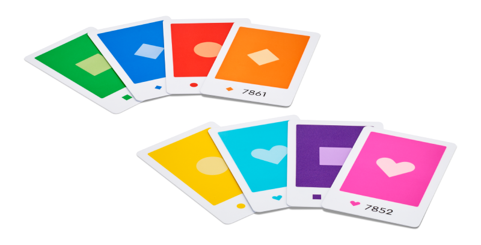

# LEGO® Education Python API


1. [Introduction and Installation](./README.md)
2. **Connect and Run**
3. [Single Motor](./singlemotor.md)
4. [Double Motor](./doublemotor.md)
5. [Color Sensor](./colorsensor.md)
6. [Controller](./controller.md)
7. [Combine Single Motor and Color Sensor](./combine1.md)
8. [Combine Double Motor and Controller](./combine2.md)
9. [Constants](./constants.md)

---
# Connect and Run

There are 6 steps to connecting to, interacting with, and disconnecting from LEGO® Education hardware using the LEGO Education Python API.

1. Import the `legoeducation` library
2. Define a variable for the hardware
3. Connect to the hardware
4. Check if connected
5. Interact with the hardware
6. Disconnect from the hardware

An example of the full *Connect and Run* process, for a Single Motor, can be found in the following example: [connect.py](./examples/connect.py).

## 1. Import the LEGO Education Python API

To use the LEGO Education Python API in your Python code, you need to import the library. Use the `le` alias for easily referencing it later.

```python
import legoeducation as le
```

## 2. Define a local variable

Define a local variable for the type of hardware you are using (example: Single Motor).

```python
singlemotor = le.SingleMotor()
```

Examples for the four types of LEGO Education hardware:
- ```python
  singlemotor = le.SingleMotor()
  ```
- ```python
  doublemotor = le.DoubleMotor()
  ```
- ```python
  colorsensor = le.ColorSensor()
  ```
- ```python
  controller = le.Controller()
  ```

## 3. Connect

Make sure the LEGO Education motor(s) and sensor(s) you are using are charged, powered on, and in Bluetooth broadcasting mode.

By default, the `connect()` function will connect to the first found. In environments with multiple hardware broadcasting simultaneously, to ensure connection to the right one, use a Connection Card and filter by specifying the connection card color and serial number when connecting.

For example, to connect to a Azure connection card with serial number '3683':

```python
singlemotor.connect(card_color=le.LEGO_COLOR_AZURE, card_serial="3683")
```



The Connection Card colors, from left-to-right in the image, are:
1. `le.LEGO_COLOR_GREEN`
2. `le.LEGO_COLOR_BLUE`
3. `le.LEGO_COLOR_RED`
4. `le.LEGO_COLOR_ORANGE`
5. `le.LEGO_COLOR_YELLOW`
6. `le.LEGO_COLOR_AZURE`
7. `le.LEGO_COLOR_PURPLE`
8. `le.LEGO_COLOR_MAGENTA`

You can create as many LEGO Education hardware connections as you like, but this may affect the responsiveness.

## 4. Check if connected

The `connected` Boolean can be used to check if the connection attempt was successful or not. For instance, if no hardware was connected, then you could exit the program.

```python
if not singlemotor.connected:
	print('Error connecting to Single Motor.')
	exit(1) # error connecting
```

## 5. Interact

Once successfully connected, you can use the LEGO Education Python API to interact with the hardware. See the following examples for using the different LEGO Education hardware:

- [Single Motor](./singlemotor.md)
- [Double Motor](./doublemotor.md)
- [Color Sensor](./colorsensor.md)
- [Controller](./controller.md)

## 6. Disconnect

When done interacting, disconnect from the device with the `disconnect()` function. The hardware will disconnect from your computer and return to broadcast mode (ready to connect again).

```python
singlemotor.disconnect()
```

## Example

See [connect.py](./examples/connect.py) for a full example of this *Connect and Run* process.

---

**Next:** [Single Motor](./singlemotor.md)