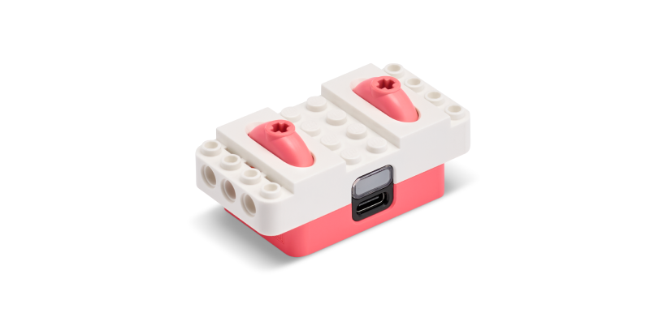

# LEGO® Education Python API


1. [Introduction and Installation](./README.md)
2. [Connect and Run](./connect.md)
3. [Single Motor](./singlemotor.md)
4. [Double Motor](./doublemotor.md)
5. [Color Sensor](./colorsensor.md)
6. **Controller**
7. [Combine Single Motor and Color Sensor](./combine1.md)
8. [Combine Double Motor and Controller](./combine2.md)
9. [Constants](./constants.md)

---
# Controller



The Controller allows control and monitoring of a controller.

# Reading Data

Reading data from the Controller can be done inline within your code or via a callback.

## Inline

```
import legoeducation as le
import time

# update these values to match the Connection Card
card_color = le.LEGO_COLOR_AZURE
card_serial = '3683'

# Connect to the Controller
controller = le.Controller()
controller.connect(card_color=card_color, card_serial=card_serial)

# Check connection
if not controller.connected:
	print('Error connecting to Controller.')
	exit(1) # error connecting

# Print lever positions (%) for five seconds
for i in range(50):
	print(f"Left lever: {controller.sensor.leftPercent}, Right lever: {controller.sensor.rightPercent}")
	time.sleep(0.1)

# Disconnect
controller.disconnect()
exit(0) # successful execution
```

## Callback

```
import legoeducation as le
import time

# update these values to match the Connection Card
card_color = le.LEGO_COLOR_AZURE
card_serial = '3683'

# Callback for monitoring position
def notification_callback(data):
	parsed_items = le.device_notification_parser(data)
	for parsed_item in parsed_items: 
		if isinstance(parsed_item, le.ControllerNotification):
			print(f"Left lever: {parsed_item.leftPercent}, Right lever: {parsed_item.rightPercent}")

# Connect to the Controller
controller = le.Controller()
controller.connect(card_color=card_color, card_serial=card_serial)
controller.set_notification_callback(notification_callback) # set callback

# Check connection
if not controller.connected:
	print('Error connecting to Controller.')
	exit(1) # error connecting

# Wait for 5 seconds (while data is streaming via callback)
time.sleep(5)

# Disconnect
controller.disconnect()
exit(0) # successful execution
```

# Example

See [controller.py](./examples/controller.py) for an example of interacting with the Controller.

# Other Functions

There are other available ways for interacting with the Controller. Here are a few common ones:

## Available Data

Controller data (from the controller, e.g. `controller.sensor`):

```
leftPercent
rightPercent
leftAngle
rightAngle
```

## Hardware Control

For control of the button light color and sound beeps:

```
controller.light_color(le.LEGO_COLOR_BLUE, pattern=le.LIGHT_PATTERN_BREATHE, intensity=100)
controller.beep(pattern=le.SOUND_PATTERN_BEEP_SINGLE, frequency=440)
```

# For more information

For more information about interacting with the Controller through the LEGO® Education Python API, use the Python `help()` command:

`help(le.Controller)`

---

**Next:** [Combine Single Motor and Color Sensor](./combine1.md)