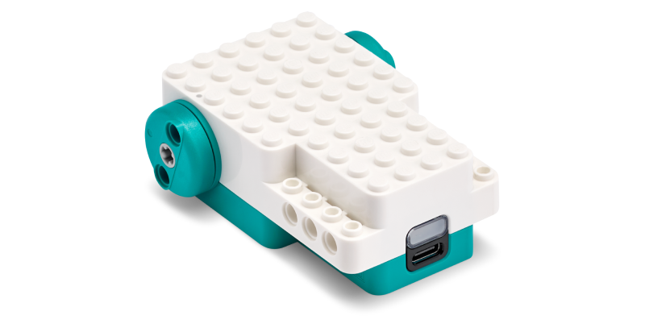

# LEGO® Education Python API


1. [Introduction and Installation](./README.md)
2. [Connect and Run](./connect.md)
3. [Single Motor](./singlemotor.md)
4. **Double Motor**
5. [Color Sensor](./colorsensor.md)
6. [Controller](./controller.md)
7. [Combine Single Motor and Color Sensor](combine1.md)
8. [Combine Double Motor and Controller](combine2.md)
9. [Constants](constants.md)

---
# Double Motor



The Double Motor allows precise control and monitoring of a double motor.

# Controlling the Motor

Here is an example for driving forward for 180-degrees.

```
import legoeducation as le

# update these values to match the Connection Card
card_color = le.LEGO_COLOR_AZURE
card_serial = '3683'

# Connect to the Double Motor
doublemotor = le.DoubleMotor()
doublemotor.connect(card_color=card_color, card_serial=card_serial)

# Check connection
if not doublemotor.connected:
	print('Error connecting to Double Motor.')
	exit(1) # error connecting

# Drive for 180-degrees
doublemotor.movement_move_for_degrees(180)

# Disconnect
doublemotor.disconnect()
exit(0) # successful execution
```

The `movement_move_for_degrees` also accepts optional parameters for direction and speed.  For example, to drive backward at 10%:

`doublemotor.movement_move_for_degrees(180, direction=le.MOVEMENT_MOVE_DIRECTION_BACKWARD, speed=10)`

# Reading Data

Reading data from the Double Motor can be done inline within your code or via a callback.

## Inline

```
import legoeducation as le
import time

# update these values to match the Connection Card
card_color = le.LEGO_COLOR_AZURE
card_serial = '3683'

# Connect to the Double Motor
doublemotor = le.DoubleMotor()
doublemotor.connect(card_color=card_color, card_serial=card_serial)

# Check connection
if not doublemotor.connected:
	print('Error connecting to Double Motor.')
	exit(1) # error connecting

# Print both motor positions for five seconds
for i in range(50):
	print(f"Left Position: {doublemotor.motor[le.MOTOR_LEFT].position}, Right Position: {doublemotor.motor[le.MOTOR_RIGHT].position}")
	time.sleep(0.1)

# Disconnect
doublemotor.disconnect()
exit(0) # successful execution
```

## Callback

```
import legoeducation as le
import time

# update these values to match the Connection Card
card_color = le.LEGO_COLOR_AZURE
card_serial = '3683'

# Callback for monitoring position
def notification_callback(data):
	parsed_items = le.device_notification_parser(data)
	for parsed_item in parsed_items: 
		if isinstance(parsed_item, le.MotorNotification):
			if (parsed_item.motorBitMask == le.MOTOR_BITS_LEFT):
				print(f"Left Motor Position: {parsed_item.position}")
			if (parsed_item.motorBitMask == le.MOTOR_BITS_RIGHT):
				print(f"Right Motor Position: {parsed_item.position}")

# Connect to the Double Motor
doublemotor = le.DoubleMotor()
doublemotor.connect(card_color=card_color, card_serial=card_serial)
doublemotor.set_notification_callback(notification_callback) # set callback

# Check connection
if not doublemotor.connected:
	print('Error connecting to Double Motor.')
	exit(1) # error connecting

# Wait for 5 seconds (while data is streaming via callback)
time.sleep(5)

# Disconnect
doublemotor.disconnect()
exit(0) # successful execution
```

# Example

See [doublemotor.py](./examples/doublemotor.py) for an example of interacting with the Double Motor.

# Other Functions

There are many functions available for interacting with the Double Motor. Here are a few common ones:

## Motor Control

Controlling both motors together (*Movement Functions*):

```
doublemotor.movement_move_for_time(time_ms=1000, direction=le.MOVEMENT_DIRECTION_BACKWARD, speed=50)
doublemotor.movement_turn_for_degrees(degrees=90, direction=le.MOVEMENT_TURN_DIRECTION_LEFT)
```

Controlling motors independently (*Motor Functions*):

```
# Rotate the right side of the Double Motor counterclockwise at 50% speed.
doublemotor.motor_run(direction=le.MOTOR_MOVE_DIRECTION_COUNTERCLOCKWISE, motor=le.MOTOR_RIGHT, speed=50)
```

Additional examples of controlling one motor:

```
doublemotor.motor_run_for_degrees(360, motor=le.MOTOR_LEFT, speed=30)
doublemotor.motor_run_for_time(2000)
doublemotor.motor_stop()
```

## IMU Settings

```
doublemotor.imu_reset_yaw_axis(0) # reset yaw to new value
doublemotor.imu_set_yaw_face(yaw_face=le.DEVICE_FACE_LEFT) # set to Device Face constants
```

## Available Data

Motor data (from each motor, e.g. `doublemotor.motor[le.MOTOR_LEFT]`):

```
motorBitMask # compare to Motor Bits constants
motorState # compare to Motor State constants
absolutePos
power
speed
position
gesture # compare to Motor Gesture constants
```

IMU data (from the internal IMU, e.g. `doublemotor.imu_device`).

```
orientation # compare to Device Face constants
yawFace # compare to Device Face constants
yaw
pitch
roll
accelerometerX
accelerometerY
accelerometerZ
gyroscopeX
gyroscopeY
gyroscopeZ
```

IMU gesture (from the internal IMU, e.g. `doublemotor.imu_gesture`).

```
gesture # compare to Motion Gesture constants
```

## Hardware Control

For control of the button light color and sound beeps:

```
doublemotor.light_color(le.LEGO_COLOR_BLUE, pattern=le.LIGHT_PATTERN_BREATHE, intensity=100)
doublemotor.beep(pattern=le.SOUND_PATTERN_BEEP_SINGLE, frequency=440)
```

# For more information

For more information about interacting with the Double Motor through the LEGO® Education Python API, use the Python `help()` command:

`help(le.DoubleMotor)`

---

**Next:** [Color Sensor](./colorsensor.md)