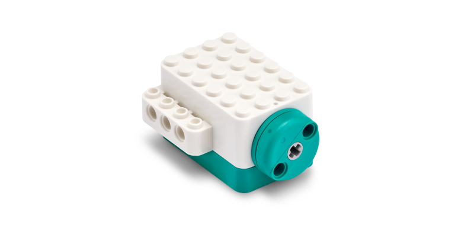

# LEGO® Education Python API


1. [Introduction and Installation](./README.md)
2. [Connect and Run](./connect.md)
3. **Single Motor**
4. [Double Motor](./doublemotor.md)
5. [Color Sensor](./colorsensor.md)
6. [Controller](./controller.md)
7. [Combine Single Motor and Color Sensor](./combine1.md)
8. [Combine Double Motor and Controller](./combine2.md)
9. [Constants](./constants.md)

---
# Single Motor



The Single Motor allows precise control and monitoring of a single motor. 

# Controlling the Motor

Here is an example for running the single motor for 180-degrees.

```
import legoeducation as le

# update these values to match the Connection Card
card_color = le.LEGO_COLOR_AZURE
card_serial = '3683'

# Connect to the Single Motor
singlemotor = le.SingleMotor()
singlemotor.connect(card_color=card_color, card_serial=card_serial)

# Check connection
if not singlemotor.connected:
	print('Error connecting to Single Motor.')
	exit(1) # error connecting

# Move single motor for 180-degrees
singlemotor.motor_run_for_degrees(180)

# Disconnect
singlemotor.disconnect()
exit(0) # successful execution
```

The `motor_run_for_degrees` also accepts optional parameters for direction and speed.  For example, to run full speed counter-clockwise:

`singlemotor.motor_run_for_degrees(180, direction=le.MOTOR_MOVE_DIRECTION_COUNTERCLOCKWISE, speed=100)`

# Reading Data

Reading data from the Single Motor can be done inline within your code or via a callback.

## Inline

```
import legoeducation as le
import time

# update these values to match the Connection Card
card_color = le.LEGO_COLOR_AZURE
card_serial = '3683'

# Connect to the Single Motor
singlemotor = le.SingleMotor()
singlemotor.connect(card_color=card_color, card_serial=card_serial)

# Check connection
if not singlemotor.connected:
	print('Error connecting to Single Motor.')
	exit(1) # error connecting

# Print the single motor position for five seconds
for i in range(50):
	print(f"Position: {singlemotor.motor.position}")
	time.sleep(0.1)

# Disconnect
singlemotor.disconnect()
exit(0) # successful execution
```

## Callback

```
import legoeducation as le
import time

# update these values to match the Connection Card
card_color = le.LEGO_COLOR_AZURE
card_serial = '3683'

# Callback for monitoring position
def notification_callback(data):
	parsed_items = le.device_notification_parser(data)
	for parsed_item in parsed_items: 
		if isinstance(parsed_item, le.MotorNotification):
			print(f"Position: {parsed_item.position}")

# Connect to the Single Motor
singlemotor = le.SingleMotor()
singlemotor.connect(card_color=card_color, card_serial=card_serial)
singlemotor.set_notification_callback(notification_callback) # set callback

# Check connection
if not singlemotor.connected:
	print('Error connecting to Single Motor.')
	exit(1) # error connecting

# Wait for 5 seconds (while data is streaming via callback)
time.sleep(5)

# Disconnect
singlemotor.disconnect()
exit(0) # successful execution
```

# Example

See [singlemotor.py](./examples/singlemotor.py) for an example of interacting with the Single Motor.

# Other Functions

There are many functions available for interacting with the Single Motor. Here are a few common ones:

## Motor Control

For controlling the motor:

```
singlemotor.motor_run(direction=le.MOTOR_MOVE_DIRECTION_COUNTERCLOCKWISE, speed=50) # counter-clockwise at speed 50%
singlemotor.motor_run_for_degrees(degrees=360)
singlemotor.motor_run_for_time(2000) # time in ms, so here: 2 seconds
singlemotor.motor_set_speed(40) # Set motor to 40% speed
singlemotor.motor_stop()
```

## Available Data

Motor data (e.g. `singlemotor.motor`):

```
motorState # compare to Motor State constants
absolutePos
power
speed
position
gesture # compare to Motor Gesture constants
```

## Hardware Control

For control of the button light color and sound beeps:

```
singlemotor.light_color(le.LEGO_COLOR_BLUE, pattern=le.LIGHT_PATTERN_BREATHE, intensity=100)
singlemotor.beep(pattern=le.SOUND_PATTERN_BEEP_SINGLE, frequency=440)
```

# For more information

For more information about interacting with the Single Motor through the LEGO® Education Python API, use the Python `help()` command:

`help(le.SingleMotor)`

---

**Next:** [Double Motor](./doublemotor.md)